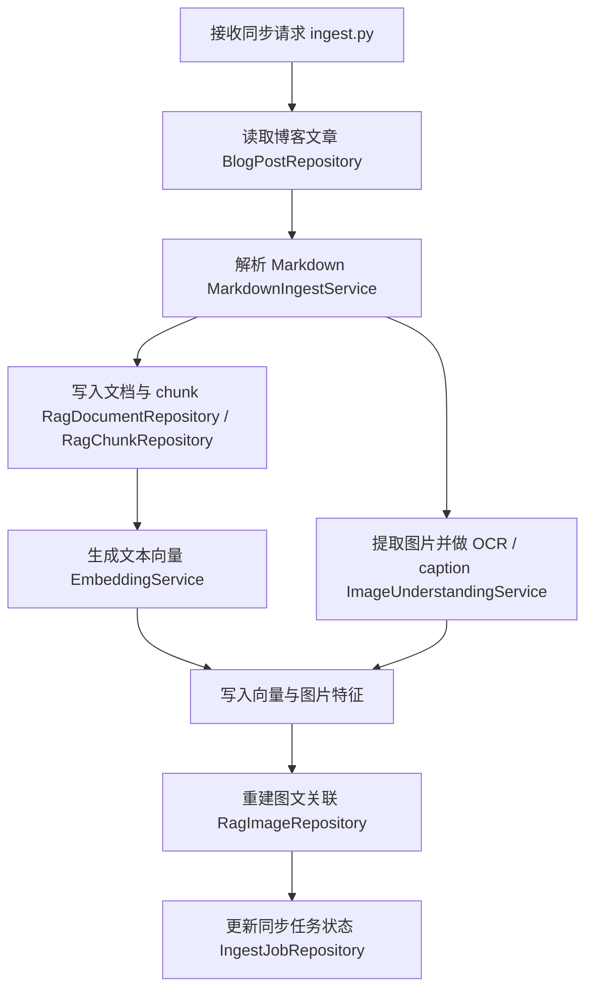
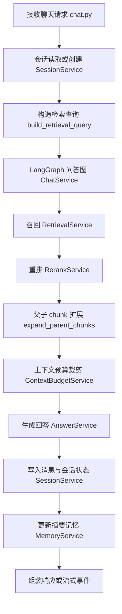

# 后端架构

## 适用范围

本文档描述当前仓库：

- `D:\code\learning_rag`

当前主线目标：

- 把原先偏 CLI / Demo 的 RAG 工程，演进成可供 `geminiBlog` 调用的 FastAPI 后端

关联博客项目：

- `E:\code\geminiBlog`

## 一、当前总体结构

当前实现按以下分层组织：

1. 接口层
   对外暴露 HTTP API，负责参数校验、依赖注入和响应序列化

2. 服务层
   承载同步链路、问答编排、上下文预算、会话记忆、图片理解等核心业务

3. 仓储层
   负责读取博客真源和读写 RAG / 会话相关表

4. 模型层
   定义 SQLAlchemy ORM 模型和数据库结构

5. 文档与契约层
   负责对外 API 契约、接入文档、维护文档和任务清单

## 二、目录职责

### `app/api`

- `routes/chat.py`
  聊天接口、流式接口、会话查询接口

- `routes/ingest.py`
  单篇同步、全量重建、任务查询接口

- `routes/health.py`
  健康检查接口

- `deps.py`
  统一错误结构和异常处理

### `app/core`

- `config.py`
  运行时配置和环境变量加载

- `database.py`
  SQLAlchemy 引擎、会话工厂、表结构初始化

- `logging.py`
  Loguru 日志格式与请求链路字段

### `app/models`

主要分成三组表：

- RAG 索引相关
  - `rag_document.py`
  - `rag_chunk.py`
  - `rag_embedding.py`
  - `rag_image.py`
  - `ingest_job.py`

- 会话与消息相关
  - `chat_session.py`
  - `chat_message.py`
  - `memory_record.py`

- 通用辅助
  - `mixins.py`

### `app/repositories`

- `blog_post_repository.py`
  从 `geminiBlog` 的 `Post` 表读取文章真源

- `rag_*_repository.py`
  负责 RAG 表的写入、替换和查询

- `chat_*_repository.py`、`memory_repository.py`
  负责会话、消息和摘要记忆的读写

### `app/services`

- `ingest_service.py`
  串联单篇同步和全量重建主流程

- `chat_service.py`
  作为问答主入口，调度会话、召回、重排、生成和记忆更新

- `orchestration_service.py`
  提供 `LangGraph` 运行时与检查点入口

- `retrieval_service.py`
  文本 chunk 和图片文本特征召回

- `rerank_service.py`
  百炼 rerank 封装与本地兜底重排

- `answer_service.py`
  问答生成与本地回退回答

- `session_service.py`
  会话隔离、历史裁剪、检索查询构造、会话查询

- `memory_service.py`
  会话摘要记忆更新

- `context_budget_service.py`
  上下文预算分配和裁剪

- `image_understanding_service.py`
  OCR / caption 与图片文本特征生成

### `legacy/cli_demo`

- 迁移期保留的旧版本地 CLI Demo、评估脚本和实验模块
- 不属于当前 FastAPI 正式运行时
- 仅通过根目录 `main.py --legacy-cli` 按需加载

## 三、两条核心业务链

### 1. 同步链路

### 2. 问答链路

## 四、为什么主运行时直接选择 `LangGraph`

当前实现没有继续使用高层 `LangChain` chain 作为主结构，原因很明确：

- 问答已经不只是单轮 `retrieve -> generate`
- 需要会话恢复、上下文裁剪、摘要记忆、流式输出、后续 Agent 扩展
- 这些能力更适合作为显式节点编排，而不是隐藏在高层链抽象里

当前最小问答图位于：

- `app/services/chat_service.py`

当前节点顺序：

1. `retrieve`
2. `rerank`
3. `expand_context`
4. `trim_context`
5. `generate`

## 五、持久化策略

### 1. 业务持久化

以下数据持久化到 PostgreSQL：

- 同步任务
- RAG 文档
- 文本 chunk
- 向量
- 图片与图片特征
- 会话
- 消息
- 摘要记忆

### 2. 图运行时持久化

当前 `LangGraph` 检查点使用：

- `InMemorySaver`

这意味着：

- 进程存活期间，可以按 `session_id` 维持图状态
- 服务重启后，图级 checkpoint 不会保留
- 但业务消息、摘要和会话元数据仍在 PostgreSQL 中

这是当前实现刻意接受的阶段性取舍，主要原因是先把问答 API、会话隔离和业务持久化稳定下来。

## 六、会话隔离与记忆边界

### 当前硬约束

- 不同访客不能共用同一套会话记忆
- 知识库可以共享
- 会话历史、摘要和检查点引用必须按 `session_id` 隔离

### 当前已落地的记忆层

- 最近消息窗口
- 会话摘要记忆

### 当前未引入的能力

- 用户长期记忆
- `mem0`

一期不引入它们，是为了避免在匿名博客场景中把作用域和运维复杂度提前放大。

## 七、上下文预算策略

上下文预算是当前正式能力，不是实现细节。

当前配置项位于：

- `app/core/config.py`
- `docs/backend/context-budget.md`

核心预算：

- `CHAT_CONTEXT_MAX_TOKENS`
- `CHAT_CONTEXT_RECENT_MESSAGES_TOKENS`
- `CHAT_CONTEXT_SUMMARY_TOKENS`
- `CHAT_CONTEXT_RETRIEVAL_TOKENS`
- `CHAT_CONTEXT_IMAGE_TOKENS`
- `CHAT_CONTEXT_RESERVED_OUTPUT_TOKENS`

当前裁剪逻辑位于：

- `app/services/context_budget_service.py`

基本原则：

- 历史消息不是全部原样回放
- 检索命中也不是全部都进入 prompt
- 图片 OCR 和 caption 必须单独控制预算

## 八、流式接口的当前实现状态

`POST /api/v1/chat/stream` 当前已对外可用，但实现方式需要明确：

- 现在是“伪流式”
- 后端先拿完整回答
- 再拆成多个 SSE 事件输出

这适合先让 `geminiBlog` 接上真实流式 UI，但不应误认为已经实现模型原生 token streaming。

## 九、当前主要限制

### 1. 同步任务仍是请求内执行

- 虽然接口返回 `202`
- 但当前同步链路还没有真正拆到异步队列

### 2. 图级 checkpoint 仍在内存中

- 重启后不会保留

### 3. 图片取回依赖可访问地址

- 如果 Markdown 图片地址仍然指向私有仓库不可直接访问资源
- OCR / caption 会失败或回退

## 十、未来接入 Deep Agents 的扩展边界

当前架构已经为更复杂的 Agent 框架预留了边界，但一期不直接引入运行依赖。

### 推荐保持不变的部分

- PostgreSQL 表结构
- 对外 HTTP API 契约
- `session_id` 语义
- `sources` / `related_images` 响应格式
- 同步链路与知识库组织方式

### 可替换的部分

- `ChatService` 内部问答图
- `orchestration_service.py` 里的图运行时装配
- 工具调用节点和多 Agent 编排节点

### 推荐接入方式

后续如果要接 Deep Agents 或类似框架，建议增加一层“编排适配器”，而不是直接把现有 API、会话服务和仓储层一起改掉。

这样可以保证：

- 前端不需要跟着换接口
- 数据表不需要整库重做
- 维护文档和排错入口还能继续沿用
