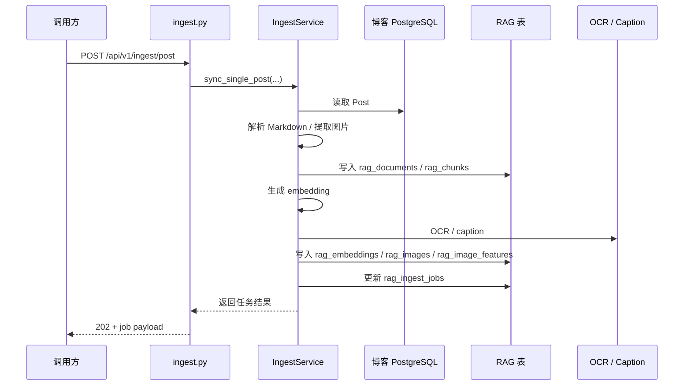
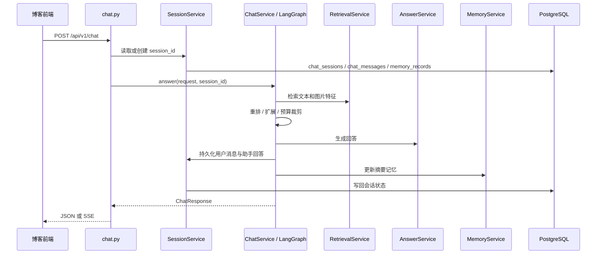

# 数据流说明

## 一、同步链路数据流

### 流程总览

### 关键输入

- `Post.title`
- `Post.slug`
- `Post.content`
- `Post.published`
- `Post.updatedAt`

### 中间产物

- 标题路径
- section
- chunk
- 图片前后文
- 图片 OCR / caption / feature summary

### 关键输出

- `rag_documents`
- `rag_chunks`
- `rag_embeddings`
- `rag_images`
- `rag_image_features`
- `rag_chunk_images`
- `rag_ingest_jobs`

## 二、问答链路数据流

### 流程总览

## 三、会话与记忆数据流

### 当前组成

1. 会话主表
   `chat_sessions`

2. 消息表
   `chat_messages`

3. 摘要记忆表
   `memory_records`

### 工作方式

- 每次请求先根据 `session_id` 定位会话
- 再读取最近消息窗口
- 历史过长时，把更早消息压缩进摘要记忆
- 当前轮完成后，重新写入用户消息和助手消息

### 关键约束

- 共享的是知识库
- 不共享的是消息、摘要和会话状态

## 四、图片数据流

### 图片从哪里来

- 文章正文中的 Markdown 图片

### 图片怎么进入 RAG

1. `MarkdownIngestService` 提取图片地址、alt、标题路径和前后文
2. `ImageUnderstandingService` 解析绝对地址并取图
3. 调 OCR 模型提取文字
4. 调 caption 模型生成中文说明
5. 组装 `feature_summary`
6. 入库 `rag_image_features`

### 图片怎么回到问答响应

1. `RetrievalService.retrieve_image_features()` 召回相关图片特征
2. `ChatService` 把命中结果交给 `build_related_images()`
3. `related_images` 返回给前端

## 五、流式接口数据流

当前 `POST /api/v1/chat/stream` 的流程是：

1. 后端先执行一次完整 `chat_service.answer()`
2. 得到完整 `ChatResponse`
3. 再拆成以下 SSE 事件：
   - `message.delta`
   - `source`
   - `related_image`
   - `context_budget`
   - `usage`
   - `message.completed`

所以它的价值主要是：

- 让前端先完成流式 UI 接入

但它当前还不是“模型边生成边返回”的原生流式。

## 六、健康检查数据流

`GET /health` 当前会聚合两类状态：

1. 数据库状态
   通过 `check_database_health()` 执行 `SELECT 1`

2. 图运行时状态
   通过 `get_orchestration_runtime().to_health_label()`

如果数据库不可用：

- 接口仍返回 `200`
- 但 `status` 会变成 `degraded`

## 七、排错时最值得看的落点

### 同步问题

- `rag_ingest_jobs`
- `rag_documents`
- `rag_chunks`
- `rag_image_features`

### 会话问题

- `chat_sessions`
- `chat_messages`
- `memory_records`

### 请求问题

- `X-Request-ID`
- `logs`
- `/health`

### 图片问题

- Markdown 中的图片地址是否可访问
- `BLOG_PUBLIC_BASE_URL` 是否配置正确
- `rag_image_features.status` 是否为 `succeeded` 或 `fallback`
